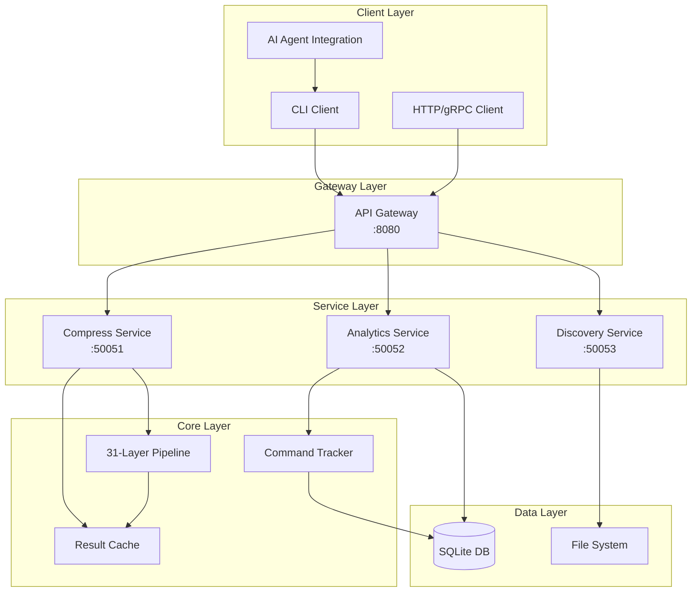
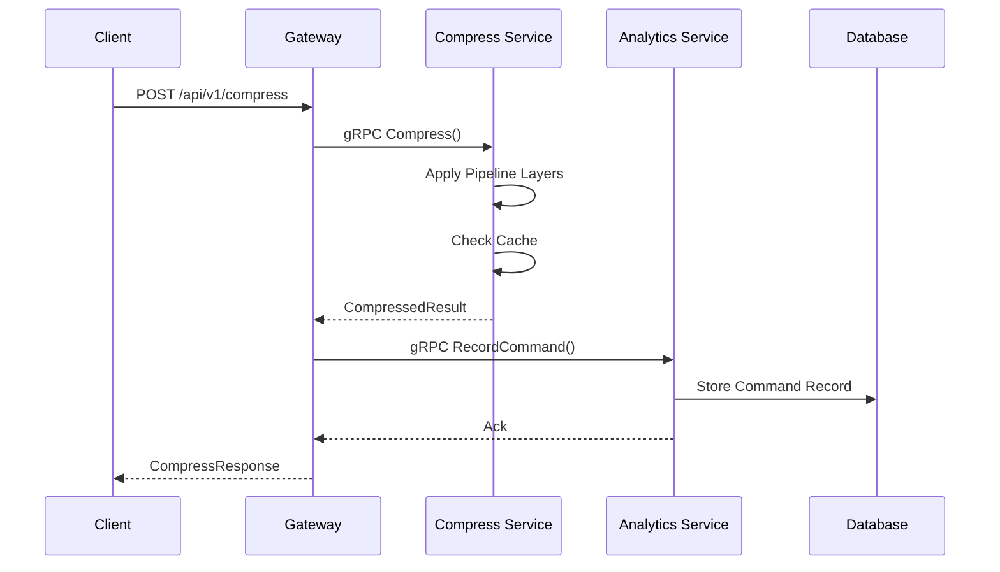
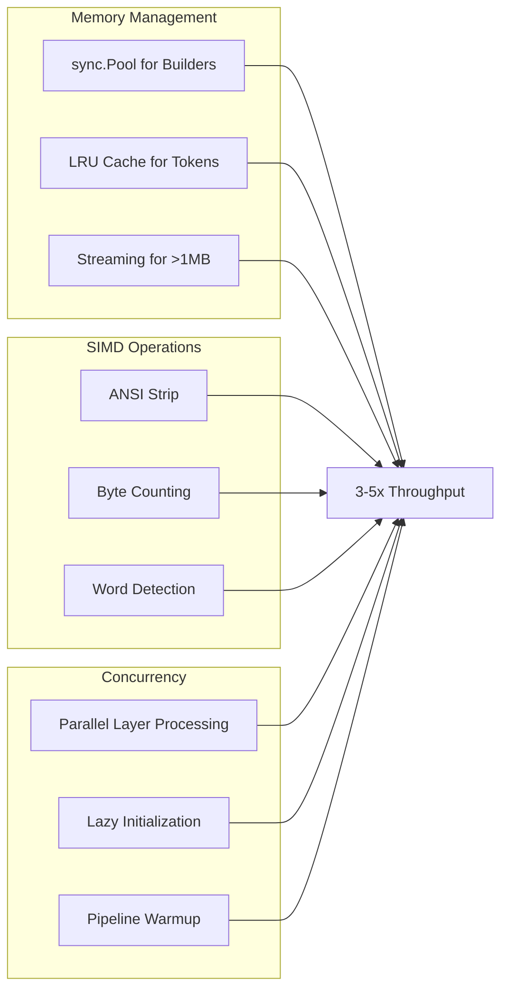
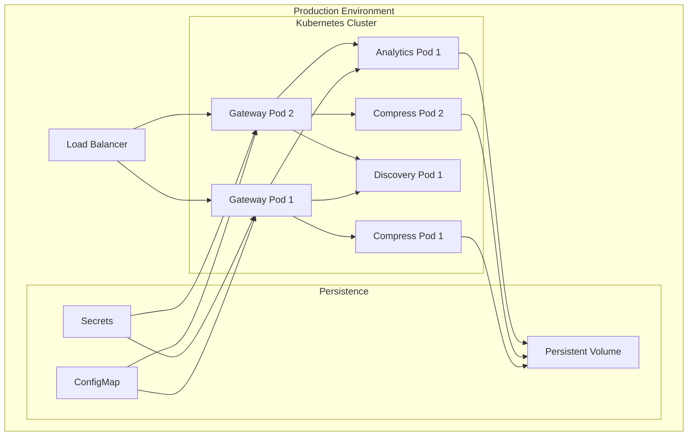

# TokMan Architecture

**Last Updated**: 2026-03-22

---

## Overview

TokMan is a token reduction system implementing a 31-layer compression pipeline for CLI output. It wraps common CLI tools (Git, Docker, npm, etc.) to intercept and compress their output using research-backed techniques.

## Core Components

### 1. CLI Entry Point (`cmd/tokman/`)

```
cmd/tokman/main.go
└── Calls commands.Execute()
```

### 2. Command Packages (`internal/commands/`)

The commands package is organized into functional categories:

| Subdirectory | Purpose | Key Files |
|--------------|---------|-----------|
| `vcs/` | Version control | git*.go, gh.go |
| `container/` | Container tools | docker.go, kubectl.go |
| `cloud/` | Cloud infrastructure | aws.go |
| `pkgmgr/` | Package managers | npm.go, pip.go, cargo.go, pnpm.go |
| `lang/` | Language runtimes | go.go, dotnet.go |
| `testrun/` | Test runners | pytest.go, jest.go, vitest.go, playwright.go, test.go |
| `linter/` | Linting tools | lint.go, mypy.go, ruff.go, golangci.go, tsc.go, prettier.go |
| `configcmd/` | Configuration | config*.go, env.go |
| `analysis/` | Metrics & analysis | count.go, cost.go, budget.go, audit.go, benchmark.go, stats.go, economics.go |
| `output/` | Output processing | diff.go, explain.go, export.go, format.go, read.go, wc.go, tree.go, context.go |
| `web/` | Web/network tools | curl.go, wget.go, proxy.go, api_proxy.go, psql.go |
| `system/` | System utilities | ls.go, find.go, grep.go, log.go, tee.go, watch.go, clean.go, snapshot.go |
| `sessioncmd/` | Session management | session.go, sessions.go, history.go, status.go, undo.go, restore.go |
| `core/` | Core CLI | root.go, init*.go, doctor.go, completion.go, alias.go, enable.go |
| `agents/` | Agent integration | agents.go, discover.go, learn.go, suggest.go, smart.go |
| `registry/` | Command registration | registry.go |

### 3. Compression Pipeline (`internal/filter/`)

The 31-layer compression pipeline:

```
internal/filter/
├── pipeline.go          # Core orchestrator
├── manager.go           # Layer manager
├── router.go            # Request router
├── presets.go           # User-facing presets
├── utils.go             # Shared utilities
│
├── layers/              # Compression layers
│   ├── entropy.go       # L1: Entropy Filtering
│   ├── perplexity.go    # L2: Perplexity Pruning
│   ├── query_aware.go   # L3: Goal-Driven Selection
│   ├── ast_preserve.go  # L4: AST Preservation
│   ├── contrastive.go   # L5: Contrastive Ranking
│   ├── ngram.go         # L6: N-gram Abbreviation
│   ├── evaluator_heads.go # L7: Evaluator Heads
│   ├── gist.go          # L8: Gist Compression
│   ├── hierarchical.go  # L9: Hierarchical Summary
│   ├── budget.go        # L10: Budget Enforcement
│   ├── compaction.go    # L11: Compaction
│   ├── attribution.go   # L12: Attribution Filter
│   ├── h2o.go           # L13: H2O Filter
│   ├── attention_sink.go # L14: Attention Sink
│   ├── meta_token.go    # L15: Meta-Token Compression
│   ├── semantic_chunk.go # L16: Semantic Chunking
│   ├── sketch_store.go  # L17: Sketch Store
│   ├── lazy_pruner.go   # L18: Lazy Pruner
│   ├── semantic_anchor.go # L19: Semantic Anchor
│   └── agent_memory.go  # L20: Agent Memory
│
├── adaptive/            # Adaptive logic
│   ├── adaptive.go
│   ├── adaptive_attention.go
│   └── density_adaptive.go
│
└── cache/               # Caching
    ├── lru_cache.go
    └── fingerprint.go
```

### 4. Infrastructure Packages (`internal/`)

| Package | Purpose |
|---------|---------|
| `config/` | Configuration loading and management |
| `tracking/` | SQLite persistence for token savings and metrics |
| `server/` | REST API for remote compression |
| `dashboard/` | Web dashboard for analytics |
| `llm/` | LLM integration for advanced compression |
| `tokenizer/` | Token counting utilities |
| `parser/` | Output parsing (binlog, etc.) |
| `cache/` | Caching infrastructure |
| `telemetry/` | Usage telemetry |
| `integrity/` | SHA-256 hook verification |
| `plugin/` | WASM plugin system |
| `tee/` | Output capture utilities |
| `utils/` | Shared utilities |

---

## Data Flow

```
┌─────────────────────────────────────────────────────────────────┐
│                         User Input                               │
│                    tokman <command>                              │
└─────────────────────────────────────────────────────────────────┘
                                │
                                ▼
┌─────────────────────────────────────────────────────────────────┐
│                      cmd/tokman/main.go                          │
│                      commands.Execute()                          │
└─────────────────────────────────────────────────────────────────┘
                                │
                                ▼
┌─────────────────────────────────────────────────────────────────┐
│                   internal/commands/                             │
│    ┌─────────────────────────────────────────────────────┐      │
│    │  Registry → Route to appropriate command handler     │      │
│    └─────────────────────────────────────────────────────┘      │
└─────────────────────────────────────────────────────────────────┘
                                │
                    ┌───────────┴───────────┐
                    ▼                       ▼
        ┌───────────────────┐    ┌───────────────────┐
        │   VCS Commands    │    │  Container Cmds   │
        │   (git, gh)       │    │  (docker, k8s)    │
        └───────────────────┘    └───────────────────┘
                    │                       │
                    └───────────┬───────────┘
                                ▼
┌─────────────────────────────────────────────────────────────────┐
│                   internal/core/runner.go                        │
│                 Execute wrapped CLI command                      │
└─────────────────────────────────────────────────────────────────┘
                                │
                                ▼
┌─────────────────────────────────────────────────────────────────┐
│                   internal/filter/pipeline.go                    │
│              Apply 31-layer compression pipeline                 │
│                                                                  │
│  L1→L2→L3→L4→L5→L6→L7→L8→L9→L10→L11→L12→L13→L14→L15→L16→L17→L18→L19→L20 │
│  Entropy → Perplexity → Goal → AST → Contrast → Ngram → Eval → │
│  Gist → Hierarchical → Budget → Compact → Attr → H2O → Sink → │
│  MetaToken → Semantic → Sketch → Lazy → Anchor → AgentMemory   │
└─────────────────────────────────────────────────────────────────┘
                                │
                                ▼
┌─────────────────────────────────────────────────────────────────┐
│                   internal/tracking/tracker.go                   │
│         Persist token savings to SQLite database                 │
└─────────────────────────────────────────────────────────────────┘
                                │
                                ▼
┌─────────────────────────────────────────────────────────────────┐
│                        Compressed Output                         │
│                   (95-99% token reduction)                       │
└─────────────────────────────────────────────────────────────────┘
```

---

## Adding New Commands

### 1. Choose the Right Category

Place your command in the appropriate subdirectory:

- `vcs/` - Version control (git, svn, hg)
- `container/` - Docker, Kubernetes, Helm
- `cloud/` - AWS, GCloud, Terraform
- `pkgmgr/` - npm, pip, cargo, pnpm
- `lang/` - Language runtimes (go, python, node)
- `testrun/` - Test runners
- `linter/` - Linting tools
- `analysis/` - Metrics and analysis
- `output/` - Output processing
- `web/` - Network tools
- `system/` - System utilities
- `sessioncmd/` - Session management
- `core/` - Core CLI commands

### 2. Create the Command File

```go
// internal/commands/vcs/mycommand.go
package vcs

import (
    "github.com/spf13/cobra"
    "github.com/GrayCodeAI/tokman/internal/commands/registry"
)

var myCmd = &cobra.Command{
    Use:   "mycommand",
    Short: "Brief description",
    RunE:  runMyCommand,
}

func init() {
    registry.Register(myCmd)
}

func runMyCommand(cmd *cobra.Command, args []string) error {
    // Implementation
    return nil
}
```

### 3. Register the Package

Add the import in `internal/commands/registration.go`:

```go
import _ "github.com/GrayCodeAI/tokman/internal/commands/vcs"
```

---

## Adding New Filter Layers

### 1. Create the Layer File

```go
// internal/filter/layers/my_layer.go
package layers

import "github.com/GrayCodeAI/tokman/internal/filter"

type MyLayer struct {
    // configuration
}

func NewMyLayer() *MyLayer {
    return &MyLayer{}
}

func (l *MyLayer) Name() string {
    return "my-layer"
}

func (l *MyLayer) Compress(input string, opts filter.Options) (string, error) {
    // Implementation
    return input, nil
}
```

### 2. Register in Pipeline

Add to `internal/filter/pipeline.go` in the appropriate position.

---

## Package Dependencies

```
                    ┌──────────────────┐
                    │   cmd/tokman     │
                    └────────┬─────────┘
                             │
                             ▼
                    ┌──────────────────┐
                    │   commands/*     │
                    │ (all subdirs)    │
                    └────────┬─────────┘
                             │
            ┌────────────────┼────────────────┐
            │                │                │
            ▼                ▼                ▼
    ┌──────────────┐ ┌──────────────┐ ┌──────────────┐
    │   filter/    │ │   config/    │ │   utils/     │
    └──────────────┘ └──────────────┘ └──────────────┘
            │
            ▼
    ┌──────────────┐
    │  tracking/   │
    └──────────────┘
```

---

## Configuration

TokMan uses hierarchical configuration:

1. **Defaults** - Built-in defaults (`internal/config/defaults.go`)
2. **Config file** - `~/.config/tokman/config.toml`
3. **Environment** - `TOKMAN_*` environment variables
4. **CLI flags** - Command-line flags (highest priority)

---

## Testing

### Unit Tests

```bash
go test ./internal/commands/...
go test ./internal/filter/...
```

### Integration Tests

```bash
go test ./tests/integration/...
```

### Benchmarks

```bash
go test -bench=. ./internal/filter/...
```

---

## Build & Release

```bash
# Build
go build -o tokman ./cmd/tokman

# Cross-compile
GOOS=linux GOARCH=amd64 go build -o tokman-linux ./cmd/tokman
GOOS=darwin GOARCH=amd64 go build -o tokman-darwin ./cmd/tokman
GOOS=windows GOARCH=amd64 go build -o tokman-windows ./cmd/tokman
```

---

## Architecture Diagrams

### High-Level Architecture



### Compression Pipeline Flow

```mermaid
flowchart LR
    subgraph "Input Processing"
        INPUT[Raw Input] --> ESTIMATE[Token Estimator]
    end

    subgraph "Stage 1: Content Analysis"
        ESTIMATE --> ENTROPY[Entropy Filter]
        ENTROPY --> PERPLEX[Perplexity Pruner]
        PERPLEX --> GOAL[Goal-Driven Selection]
    end

    subgraph "Stage 2: Structure Preservation"
        GOAL --> AST[AST Preserve]
        AST --> CONTRAST[Contrastive Ranking]
        CONTRAST --> NGRAM[N-Gram Abbreviation]
    end

    subgraph "Stage 3: Intelligent Compression"
        NGRAM --> EVAL[Evaluator Heads]
        EVAL --> GIST[Gist Compression]
        GIST --> HIER[Hierarchical Summary]
    end

    subgraph "Stage 4: Budget Enforcement"
        HIER --> BUDGET[Budget Enforcement]
        BUDGET --> COMPACT[Compaction]
        COMPACT --> ATTRIB[Attribution Filter]
    end

    subgraph "Stage 5: Memory Optimization"
        ATTRIB --> H2O[H2O Filter]
        H2O --> ATTENTION[Attention Sink]
        ATTENTION --> META[Meta-Token]
    end

    subgraph "Stage 6: Advanced Processing"
        META --> SEMANTIC[Semantic Chunk]
        SEMANTIC --> SKETCH[Sketch Store]
        SKETCH --> LAZY[Lazy Pruner]
        LAZY --> OUTPUT[Compressed Output]
    end
```



### Microservice Communication



### Performance Optimizations



### Deployment Architecture


